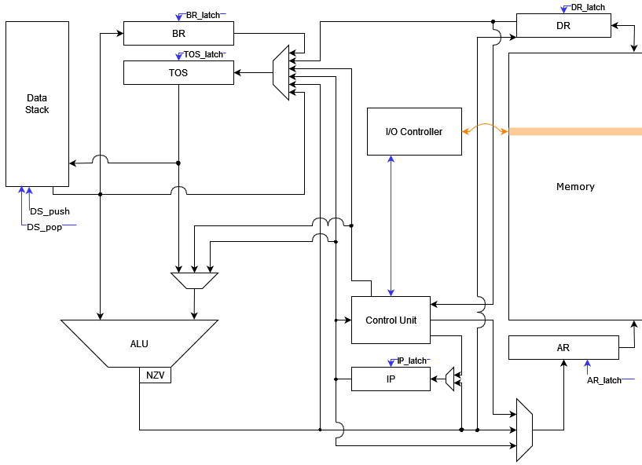
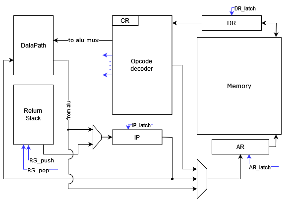

# Лабараторная работа №3

---
Векшин Арсений Иванович P3216   
`asm | stack | neum | hw | instr |struct | stream | mem | pstr | prob2 `   
Упрощенный вариант

## Язык программирования

---

Реализовано подмножество языка Assembler для программ из задания. 


### Синтаксис
```6502 assembly
    <program> ::= <line> | <line> <program>
    
    <no_arg_op> ::=   "CLA"
                    | "NEG"
                    | "INC"
                    | "DEC"
                    | "NOT"
                    | "AND"
                    | "OR"
                    | "ADD"
                    | "SUB"
                    | "CMP"
                    | "MUL"
                    | "DIV"
                    | "BEQ"
                    | "BGT"
                    | "BLT"
                    | "SWAP"
                    | "DUP"
                    | "POP"
                    | "RET"
                    | "IN"
                    | "OUT"
                    | "HLT"
                    | "NOP"
    
    <arg_op> ::=  "ST"
                | "LD"
                | "JUMP"
                | "CALL"
    
    <line_without_comment> ::= <label> | <space> <instruction>
    
    <line> ::= <line_without_comment> <space> <comment>* "\n"+
    
    <comment> ::= ";" (<label_name> | <space>)*
    
    <space> ::= ("\t" | " " | "\r")*
    
    <word> ::= "WORD " <number>
    
    <instruction> ::= <no_arg_op> | <arg_op> " " <adress>
    
    <inner_adress> ::= <label_name> | <number>
    
    <indirect_adress> ::= "[" <inner_adress> "]"
    
    <auto_adress> ::= ("+" | "-") <indirect_adress> | <indirect_adress> ("+" | "-")
    
    <absolute_adress> ::= "#" <inner_adress>
    
    <adress> ::= <indirect_adress> | <inner_adress> | <absolute_adress> | <auto_adress>
    
    <label> ::= <label_name> ":"
    
    <number> ::= [1-9] [0-9]* | "0x" ([0-9] | [A-F])+
    
    <label_name> ::= ([a-z] | [A-Z] | "_") ([a-z] | [A-Z] | "_" | [0-9])*

```


### Особенности языка
Из-за особенностей стековой архитектуры, семантика команд была изменена. Все команды, за исключением `LD`, `ST`, `JUMP`, `CALL` не имеют аргументов. 
Все операции производятся с данными, помещенными в стек.   
В прочих аспектах, язык придерживается стандарта ASM.

#### Важно: при использовании операций АЛУ, требующих более 1 аргумента (все кроме `CLA`, `NEG`, `INC`, `DEC`, `NOT`), оба значения удаляются из стека, а на его вершину записывается результат!
```
| a |        | result |
| b | -----> |        |
|___|        |________|
```

### Система команд

| __Инструкция__ | __Стек__                       | __Описание__                                                                     |
|----------------|--------------------------------|----------------------------------------------------------------------------------|
| CLA            | (... b) --> (... 0)            | Поместить 0 на вершину стека                                                     |
| NEG            | (... a ) --> (... a * (-1))    | Арифметическое * (-1)                                                            |
| INC            | (... a) --> (... a + 1)        | +1 к значению на вершине стека                                                   |
| DEC            | (... a) --> (... a - 1)        | -1 к значению на вершине стека                                                   |
|                |                                |
| NOT            | (... a ) --> (... ~a)          | Логическое НЕ вершины стека                                                      |
| AND            | (... a b) --> (... a & b)      | Логическое И двух верхних значений стека, результат поместить на вершину стека   |
| OR             | (... a b) --> (... a or b)     | Логическое ИЛИ двух верхних значений стека, результат поместить на вершину стека |
|                |                                |                                                                                  |
| ADD            | (... a b) --> (... a + b)      | Складываем два верхних числа со стека и кладем на вершину сумму                  |
| SUB            | (... a b) --> (... a - b)      | Вычитаем из a число b и кладем разность на вершину                               |
| MUL            | (... a b) --> (... a * b)      | Умножаем два верхних числа со стека и кладем на вершину результат                |
| DIV            | (... a b) --> (... a / b)      | Делим a на число b и кладем результат на вершину стека                           |
|                |                                |                                                                                  |
| SWAP           | (... a b) --> (... b a)        | Меняет местами два числа, которые лежат на вершине стека                         |
| DUP            | (... a) --> (... a a)          | Дублирует число с вершины стека и кладет дубликат на вершину                     |
| POP            | (... a) --> (...)              | Удаляет число с вершины стека                                                    |
|                |                                |                                                                                  |
| BEQ            | if (a == b): IP + 1 --> IP     | Если a равно b, то, пропуск следующей ячейки                                     |
| BGT            | if (a > b):  IP + 1 --> IP     | Если b больше a, то, пропуск следующей ячейки                                    |
| BLT            | if (a < b):  IP + 1 --> IP     | Если b меньше a, то, пропуск следующей ячейки                                    |
|                |                                |                                                                                  |
| LD ADDR        | a := Mem(ADDR) --> (... a)     |                                                                                  |
| ST ADDR        | (... a) --> Mem(ADDR) := a     |                                                                                  |
|                |                                |                                                                                  |
| JUMP ADDR      | ADDR --> IP                    | Безусловный переход к инструкции по адресу ADDR                                  |
| CALL ADDR      | RetStack.push(IP), ADDR --> IP | Вызов подпрограммы по адресу ADDR                                                |
| RET            | RetStack.pop() --> IP          | Возврат из подпрограммы                                                          |
|                |                                |                                                                                  |
| IN             |                                | отправить статус "готов" для ввода на ВУ                                         |
| OUT            |                                | отправить статус "готов" для вывода на ВУ                                        |
|                |                                |                                                                                  |
| HLT            |                                | Завершение работы программы                                                      |
| NOP            |                                | нет операции                                                                     |


### Типы адресации

| __Тип__                    | __Синтаксис__ | __Пример__     |
|----------------------------|---------------|----------------|
| Прямая абсолютная          | ADDR          | LD 0x01        |
| Прямая относительная       | [IP+N]        | LD [IP + 0x01] |
| Косвенная относительная    | [ADDR]        | LD [0x01]      |
| Косвенная автоинкрементная | [ADDR]+       | LD [0x93]+     |
| Косвенная автодекрементная | [ADDR]-       | LD [0x93]-     |
| Прямая загрузка операнда   | #VALUE        | LD #93         |


### Семантика
- Язык предполагает последовательное исполнение
- Глобальная область видимости меток   

На этапе трансляции метки заменяются численными адресами

### Литералы

- Аргументы команд - численные литералы или метки
- Поддерживаются целочисленные десятичные, а также шестнадцатеричные числа с указанием префикса `0x`

### Директивы
`WORD num` - поместить число в ячейку памяти, в соответствии с линейным порядком

### Скомпилированная программа
[Пример скомпилированной программы hello.asm](examples/hello/translator_output.txt)
Машинный код сериализуется в json:
```
    {
        "index": 3,         - адрес в памяти
        "opcode": "LD",     - код операции
        "arg": "20",        - аргумент
        "addressing": 0     - тип адресации
    }
```

## Организация памяти

---

Память команд и данных общая. Память соответствует фон Неймановской архитектуре.
Структура памяти:
```
    0: IO comunication
    ..code and data..
``` 

Примечание: команды хранятся в одной памяти с данными, в виде объектов класса Instruction, согласно варианту

## Транслятор

---

Интерфейс командной строки: `translator.py <source.file> <target.file>`     
Реализован в [translator.py](translator.py)

#### Этапы транслирования

1. Проверка корректности программы (пересечение меток, закрывающие скобки)
2. Трансформирование текста в машинный код
3. Подстановка численных значений вместо меток


## Модель процессора

---

Интерфейс командной строки: `machine.py <code_file> <input_file> <output_file> <output_mode>`   

где `<output_mode> ::= text | numeric` отвечает за то, в каком виде будут интерпретированы данные при выводе через ВУ
### DataPath

   
Реализован в классе [DataPath](src/machine.py)  
`IP` - регистр для хранения адреса исполняемой инструкции  
`AR` - регистр для хранения адреса, по которому программа обращается к памяти  
`TOS` - регистр для хранения вершины стека  
`DR` - регистр для чтения/записи в память   
`BR` - регистр для промежуточного хранения из DataStack (для операции SWAP)   
`DataStack` - стек данных  
`Memory` - общая память программы  
На схеме также изображены сигналы, которые приходят из `ControlUnit`, по которым выполняется определенное действие  

### ControlUnit

   
Реализован в классе [ControlUnit](src/machine.py)  
`CR` - регистр для хранения исполняемой инструкции   
`ReturnStack` - стек возвратов (возврат из подпрограммы)   
`Opcode decoder` - обработчик команд   

Примечание: `IP`, `AR`, `DR`, `Memory` продублированы на схеме с обвязкой, чтобы не нарушать целостности схемы
## Тестирование

---

Пример проверки исходного кода:
```commandline
Launching pytest with arguments test_machine.py::test_bar --no-header --no-summary -q in D:\Documents\csa-lab3\golden

============================= test session starts =============================
collecting ... collected 4 items

test_machine.py::test_bar[golden\cat.yml] PASSED                [ 25%]
test_machine.py::test_bar[golden\hello-username.yml] PASSED     [ 50%]
test_machine.py::test_bar[golden\hello.yml] PASSED              [ 75%]
test_machine.py::test_bar[golden\prob2.yml] PASSED              [100%]

============================== 4 passed in 0.35s ==============================

```

## Результаты

---

```
|          ФИО            |     алг      | code инстр. | инстр. | Вариант                                                               |
| Векшин Арсений Иванович | cat          | 23          | 122    | asm | stack | neum | hw | instr |struct | stream | mem | pstr | prob2 |
| Векшин Арсений Иванович | hello world  | 30          | 129    | asm | stack | neum | hw | instr |struct | stream | mem | pstr | prob2 |
| Векшин Арсений Иванович | hello user   | 65          | 330    | asm | stack | neum | hw | instr |struct | stream | mem | pstr | prob2 |
| Векшин Арсений Иванович | prob2        | 34          | 338    | asm | stack | neum | hw | instr |struct | stream | mem | pstr | prob2 |
```